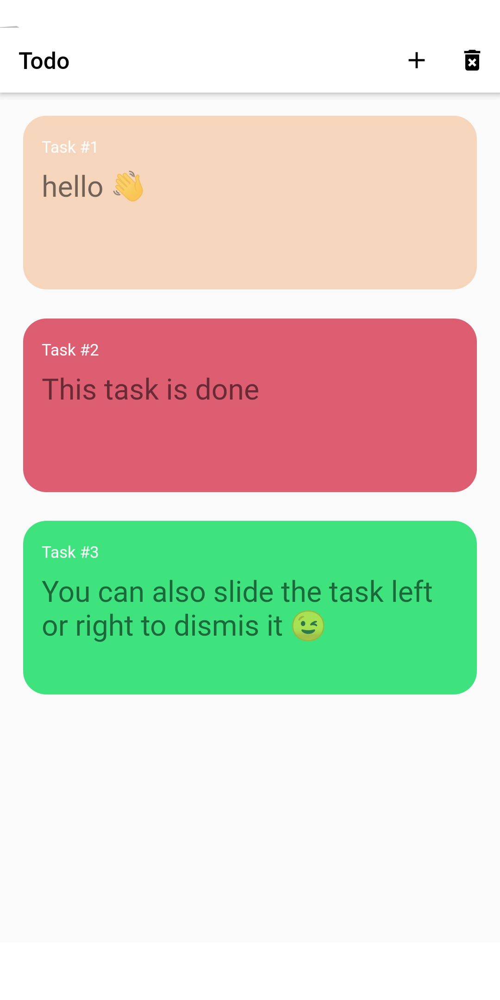

# Rainbow Todo App

A todo app designed using Flutter

## How to run

```bash
git clone https://github.com/oGranny/Rainbow-Todo-App
cd todo_app/
flutter run
```

## Try live demo

> Go to # or click here [live demo](#)

|  |  |
| ------------------------------------------------------- | ------------------------------------------------------ |
|                                                         |

|  |
| ------------------------------------- |

## Features

* 👉 Tap to mark task as done 👈
* 🥳 Slide task right or left to dismis it 🥳
* 🌈 Rainbow colors 🌈  

## TODO 🏹

* add firebase support
* add localstorage

## Contributors 🔥

[Bibhukiju](https://github.com/Bibhukiju) - made ui better

## Getting Started

This project is a starting point for a Flutter application.

A few resources to get you started if this is your first Flutter project:

- [Lab: Write your first Flutter app](https://flutter.dev/docs/get-started/codelab)
- [Cookbook: Useful Flutter samples](https://flutter.dev/docs/cookbook)

For help getting started with Flutter, view our
[online documentation](https://flutter.dev/docs), which offers tutorials,
samples, guidance on mobile development, and a full API reference.
